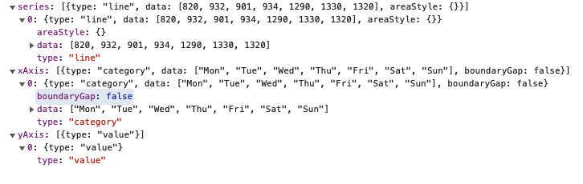

<!-- <p align="center">
    
</p> -->
<h1 align="center">ECharts Java</h1>
<p align="center">
    <em>ECharts ❤️ Java = ECharts Java</em>
</p>
<p align="center">
    <a href="https://github.com/IcePear-Jzx/ECharts-Java/actions">
        
    </a>
    <a href="https://github.com/pyecharts/pyecharts/pulls">
        
    </a>
    <a href="https://opensource.org/licenses/Apache-2.0">
        
    </a>
    <a href="https://maven-badges.herokuapp.com/maven-central/org.icepear.echarts/echarts-java">
        
    </a>
</p>

## Introduction

ECharts Java is a lightweight but comprehensive library for Java developers to easily use JavaScript visualization library [Apache ECharts](https://echarts.apache.org/en/index.html). The simple chart mode facilitates users to write visualization fast and easily, empowered by the clean APIs provided by ECharts Java. The advanced mode helps create an `Option` object and its Json representation in chainable Java codes, which includes almost all the features defined in [Apache ECharts](https://echarts.apache.org/en/index.html).

## Features

- Simple, clean and organized APIs, supporting method chaining

- Full coverage of [Apache ECharts](https://echarts.apache.org/en/index.html) functionalities

- Easily integrate with Web Frameworks

- Flexible export format, including HTML and images

- Complete and detailed documentation and examples

## Installation

For Maven project, includes the following in your pom.xml
```xml
<dependency>
  <groupId>org.icepear.echarts</groupId>
  <artifactId>echarts-java</artifactId>
  <version>1.0.0</version>
</dependency>
```

For Gradle Groovy project, includes
```
implementation 'org.icepear.echarts:echarts-java:1.0.0'
```

For more, refer to [here](https://search.maven.org/artifact/org.icepear.echarts/echarts-java/1.0.0/jar).

<<<<<<< HEAD
## Usage
=======
## Usages 
>>>>>>> 1ef373e (add readme)

### Generate Local HTML and Download Image

```java
public static void main(String[] args) {
    Bar bar = new Bar()
            .setTooltip(new Tooltip().setTrigger("axis")
                    .setAxisPointer(new TooltipAxisPointer().setType("shadow")))
            .setLegend(true)
            .addXAxis()
            .addYAxis(new String[] { "Mon", "Tue", "Wed", "Thu", "Fri", "Sat", "Sun" })
            .addSeries(createSeries("Direct", new Number[] { 320, 302, 301, 334, 390, 330, 320 }))
            .addSeries(createSeries("Mail Ad", new Number[] { 120, 132, 101, 134, 90, 230, 210 }))
            .addSeries(createSeries("Affiliate Ad", new Number[] { 220, 182, 191, 234, 290, 330, 310 }))
            .addSeries(createSeries("Video Ad", new Number[] { 150, 212, 201, 154, 190, 330, 410 }))
            .addSeries(createSeries("Search Engine", new Number[] { 820, 832, 901, 934, 1290, 1330, 1320 }));
    Engine engine = new Engine();
    engine.render("index.html", bar);
}
```
<<<<<<< HEAD
<<<<<<< HEAD

=======

>>>>>>> 1ef373e (add readme)
=======

>>>>>>> 1a06c7a (add headings for readme)

### Generate Option Object and its Json Representation

```java
public static void main(String[] args) {
    Line lineChart = new Line()
                .addXAxis(new CategoryAxis()
                        .setData(new String[] { "Mon", "Tue", "Wed", "Thu", "Fri", "Sat", "Sun" })
                        .setBoundaryGap(false))
                .addYAxis()
                .addSeries(new LineSeries()
                        .setData(new Number[] { 820, 932, 901, 934, 1290, 1330, 1320 })
                        .setAreaStyle(new LineAreaStyle()));
    Engine engine = new Engine();
    String jsonStr = engine.renderJsonOption(lineChart);
}
```
<<<<<<< HEAD
<<<<<<< HEAD


### Integrate with Spring Web Application


For demo codes, please refer to the [docs](https://echarts.icepear.org/) and [example repo](https://github.com/incandescentxxc/ECharts-Java-Examples).
=======

=======


>>>>>>> 1a06c7a (add headings for readme)
### Integrate with Spring Web Application


For demo codes, please refer to the [docs](https://echarts.icepear.org/) and [example repo](https://github.com/incandescentxxc/Echarts-Java-Examples).
>>>>>>> 1ef373e (add readme)

## Gallery
TODO

## Authors
- [@IcePear-Jzx](https://github.com/IcePear-Jzx)
- [@incandescentxxc](https://github.com/incandescentxxc)

Welcome more contribution in the community!

## Acknowledgement
- This project is inspired by the Homework 6 of the course [Principles of Software Construction Objects, Design, and Concurrency](https://cmu-17-214.github.io/f2021/), Fall 2021, at [Carnegie Mellon University](https://www.cmu.edu/). We sincerely thank [Christian](https://www.cs.cmu.edu/~ckaestne/) and [Vincent](https://vhellendoorn.github.io/) for the wonderful course.

<<<<<<< HEAD
- This project is also inspired by the [pyecharts](https://github.com/pyecharts/pyecharts) and [go-echarts](https://github.com/go-echarts/go-echarts), which are the ECharts siblings in Python and Go languages.
=======
- This project is also inspired by the [pyecharts](https://github.com/pyecharts/pyecharts) and [go-echarts](https://github.com/go-echarts/go-echarts), which are the Echart siblings in Python and Go languages.
>>>>>>> 1ef373e (add readme)

## License

ECharts Java is available under the [Apache License 2.0](LICENSE).
