<div align="center">
    
</div>
<h1 align="center">ECharts Java</h1>
<p align="center">
    <em>"We bring better visualization into Java with ECharts"</em>
</p>
<p align="center">
    <a href="https://github.com/ECharts-Java/ECharts-Java/actions">
        
    </a>
    <a href="https://github.com/pyecharts/pyecharts/pulls">
        
    </a>
    <!-- <a href="https://codecov.io/gh/ECharts-Java/ECharts-Java">
        
    </a> -->
    <a href="https://opensource.org/licenses/Apache-2.0">
        
    </a>
    <a href="https://maven-badges.herokuapp.com/maven-central/org.icepear.echarts/echarts-java">
        
    </a>
</p>

[中文 README](README.zh.md)

[Official Documentation](https://echarts.icepear.org/#/)
## 📙 Introduction

ECharts Java is a lightweight but comprehensive library for Java developers to easily use JavaScript visualization library [Apache ECharts](https://echarts.apache.org/en/index.html). The simple chart mode facilitates users to write visualization fast and easily, empowered by the clean APIs provided by ECharts Java. The advanced mode helps create an `Option` object and its Json representation in chainable Java codes, which includes almost all the features defined in [Apache ECharts](https://echarts.apache.org/en/index.html). Now ECharts Java supports Apache ECharts version 5.x.

## 🌠 Features

- Simple, clean and organized APIs, supporting method chaining

- Full coverage of [Apache ECharts](https://echarts.apache.org/en/index.html) functionalities

- Easily integrate with Web Frameworks

- Flexible export format, including HTML and images

- Complete and detailed documentation and examples

## 🔬 Installation

For a Maven project, includes the following in your pom.xml
```xml
<dependency>
  <groupId>org.icepear.echarts</groupId>
  <artifactId>echarts-java</artifactId>
  <version>1.0.7</version>
</dependency>
```

For a Gradle Groovy project, includes
```
implementation 'org.icepear.echarts:echarts-java:1.0.7'
```

For more, refer to [here](https://search.maven.org/artifact/org.icepear.echarts/echarts-java/1.0.7/jar).

## 🔭 Usage

### Generate Local HTML and Download Image

```java
public static void main(String[] args) {
    // All methods in EChart Java supports method chaining
    Bar bar = new Bar()
              .setLegend()
              .setTooltip("item")
              .addXAxis(new String[] { "Matcha Latte", "Milk Tea", "Cheese Cocoa", "Walnut Brownie" })
              .addYAxis()
              .addSeries("2015", new Number[] { 43.3, 83.1, 86.4, 72.4 })
              .addSeries("2016", new Number[] { 85.8, 73.4, 65.2, 53.9 })
              .addSeries("2017", new Number[] { 93.7, 55.1, 82.5, 39.1 });
    Engine engine = new Engine();
    // The render method will generate our EChart into a HTML file saved locally in the current directory.
    // The name of the HTML can also be set by the first parameter of the function.
    engine.render("index.html", bar);
}
```


### Generate Option Object and its JSON Representation

```java
public static void main(String[] args) {
    Line lineChart = new Line()
                .addXAxis(new CategoryAxis()
                        .setData(new String[] { "Mon", "Tue", "Wed", "Thu", "Fri", "Sat", "Sun" })
                        .setBoundaryGap(false))
                .addYAxis()
                .addSeries(new LineSeries()
                        .setData(new Number[] { 820, 932, 901, 934, 1290, 1330, 1320 })
                        .setAreaStyle(new LineAreaStyle()));
    Engine engine = new Engine();
    // It is recommended that you can  get the serialized version of Option in the representation of JSON, which can be used directly in the template or in the RESTful APIs.
    String jsonStr = engine.renderJsonOption(lineChart);
}
```

The output JSON object will be like the following,

```json
{
  "xAxis": [
    {
      "type": "category",
      "data": ["Mon", "Tue", "Wed", "Thu", "Fri", "Sat", "Sun"],
      "boundaryGap": false
    }
  ],
  "yAxis": [{ "type": "value" }],
  "series": [
    {
      "type": "line",
      "data": [820, 932, 901, 934, 1290, 1330, 1320],
      "areaStyle": {}
    }
  ]
}
```

### Integrate with Spring Web Application

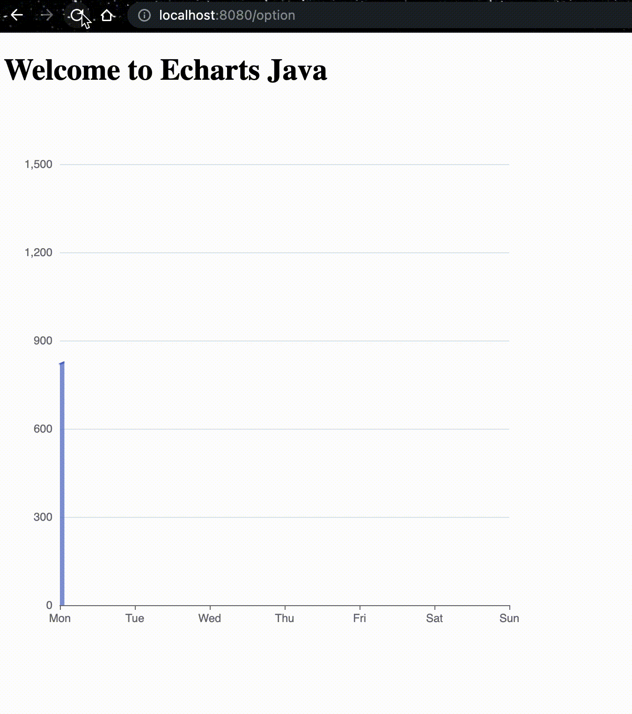

For demo codes, please refer to the [docs](https://echarts.icepear.org/) and [example repo](https://github.com/incandescentxxc/ECharts-Java-Examples).

## 🎇 Gallery

<p float="center">
  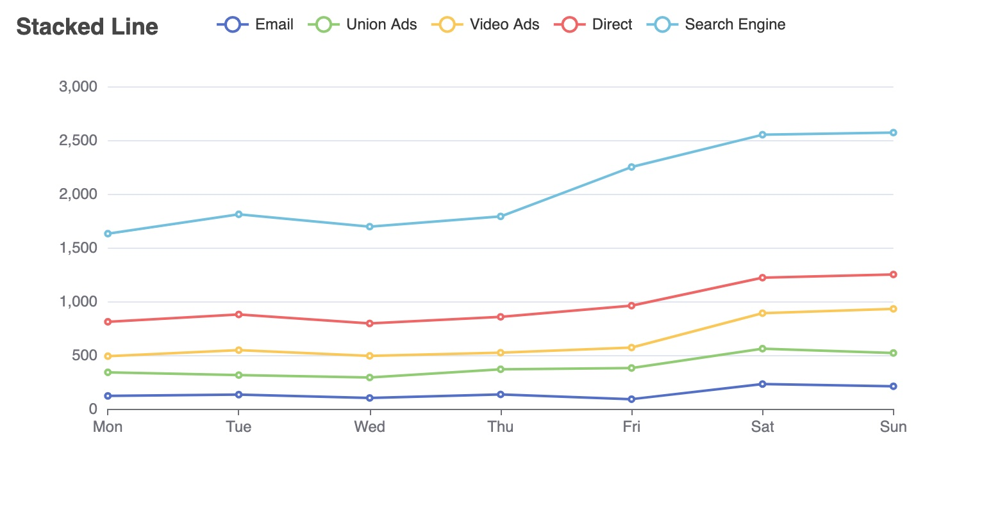
  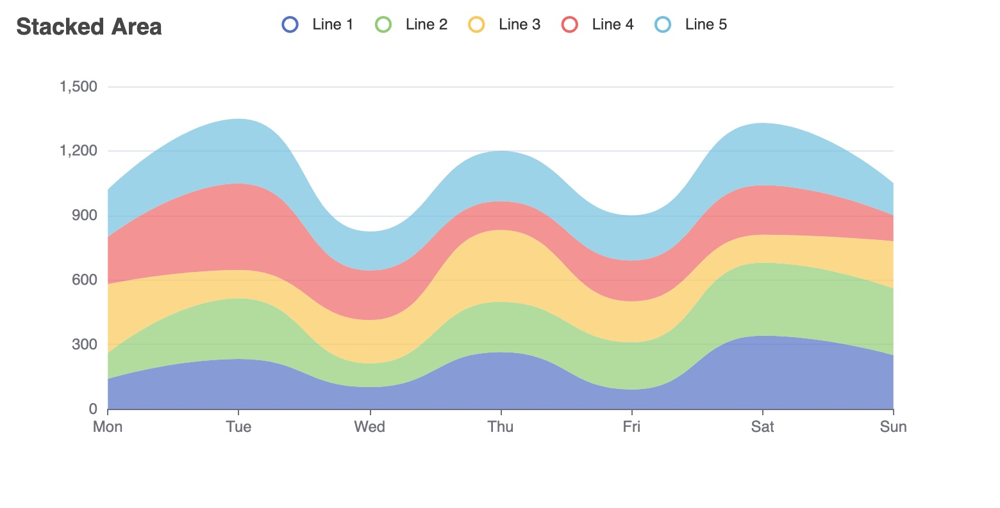 
  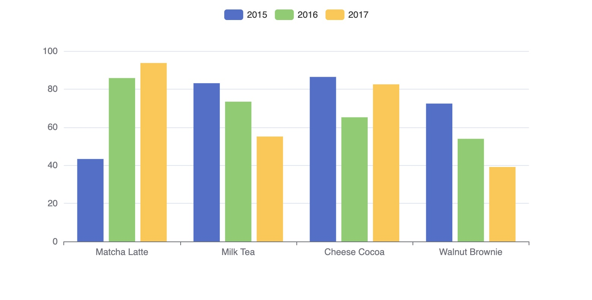
   
  
  <!-- 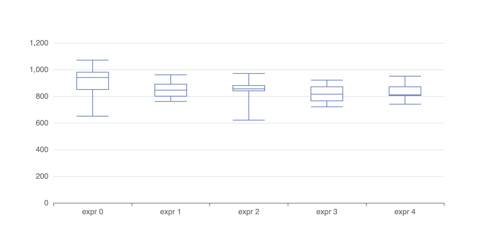  -->
  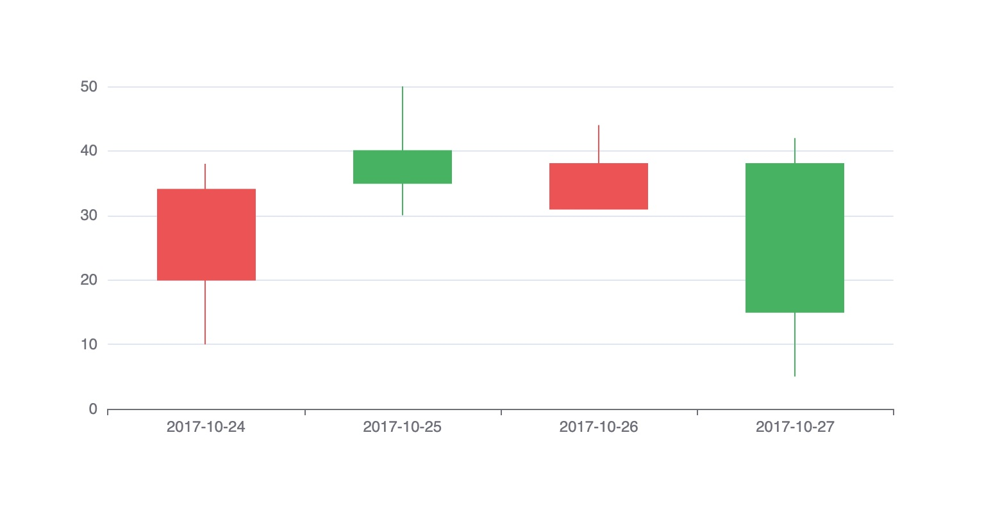 
   
   
   
  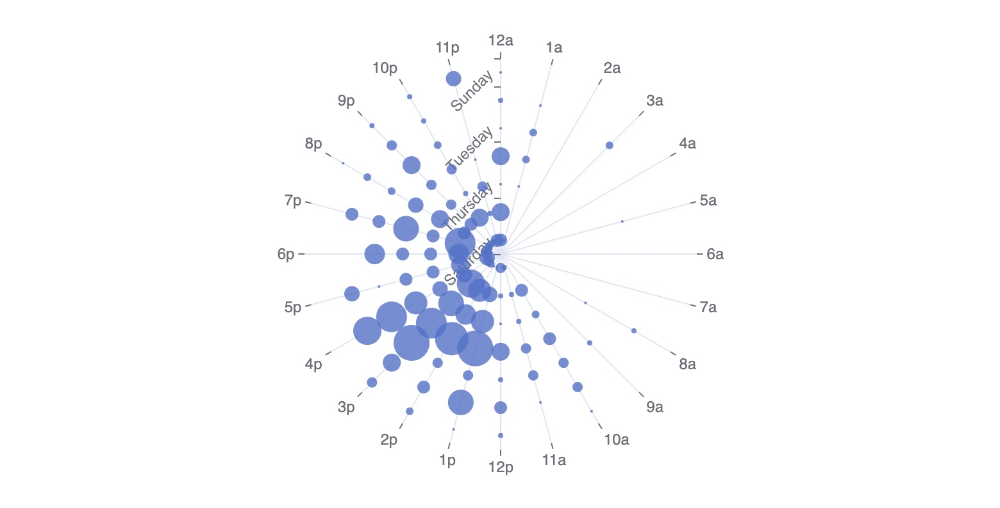 
  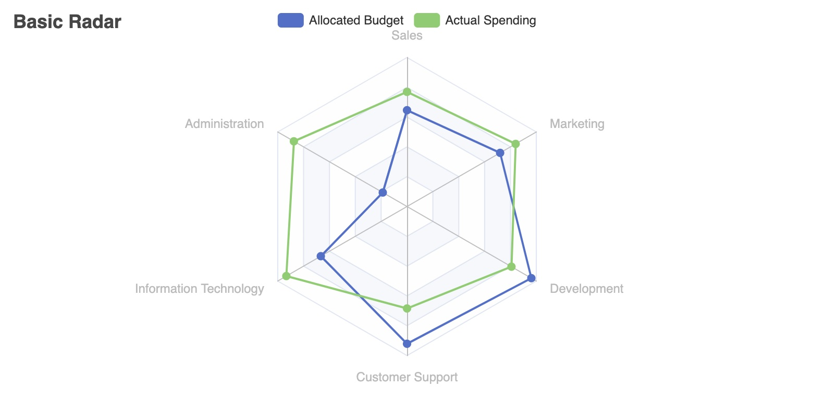 
  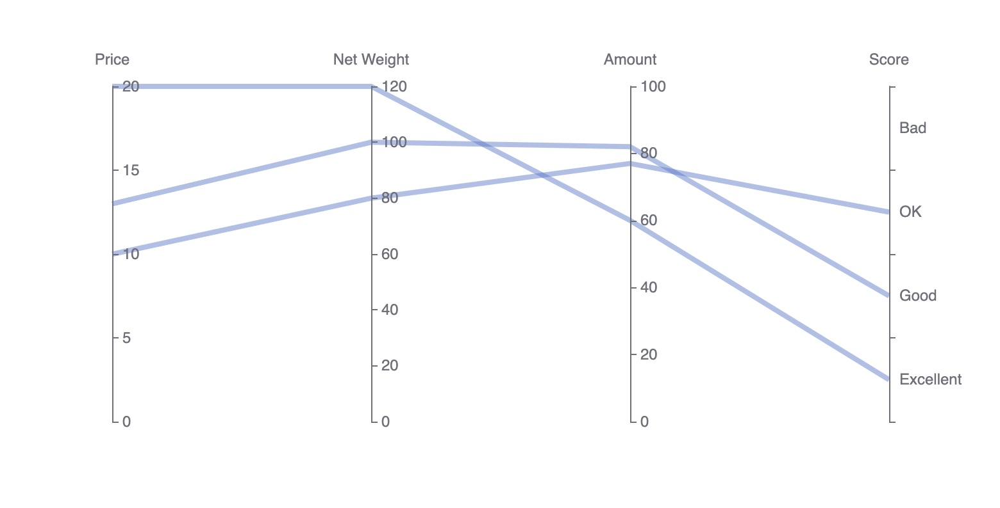
  
  
  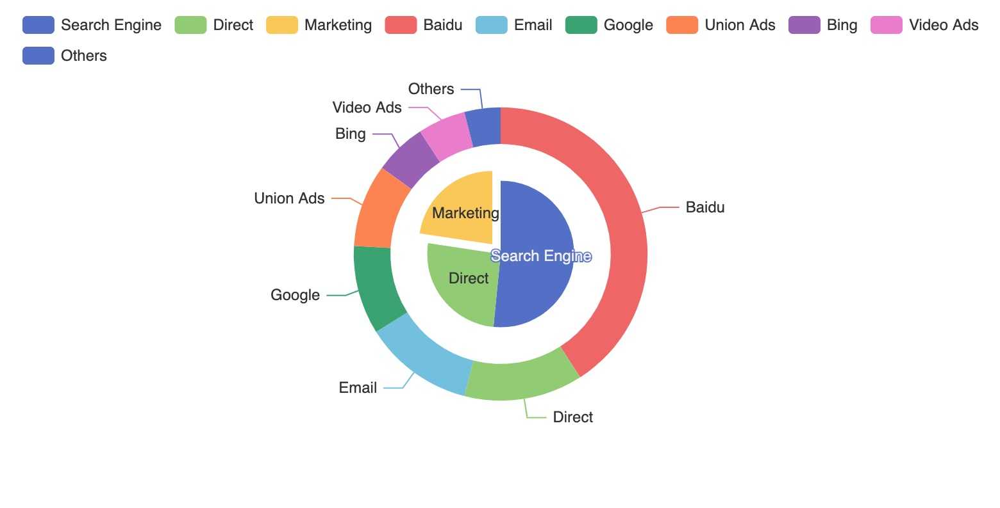
  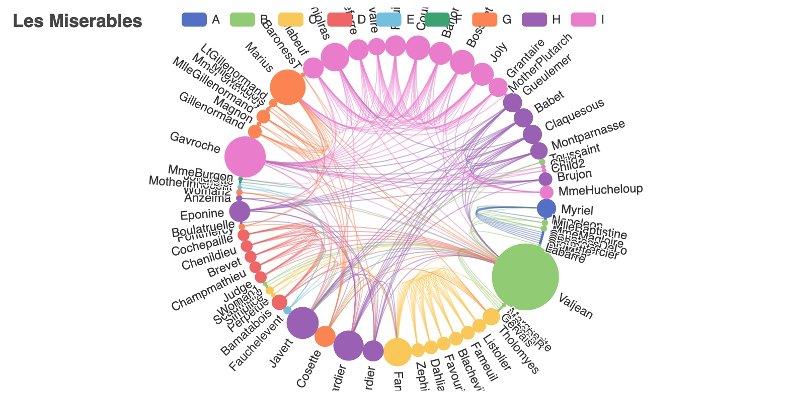
  
  
  
  
  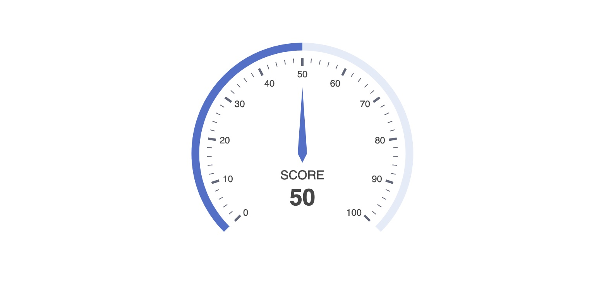 
</p>

## 💡 Authors
- [@IcePear-Jzx](https://github.com/IcePear-Jzx)
- [@incandescentxxc](https://github.com/incandescentxxc)

Welcome more contribution in the community!

## 💌 Acknowledgement
- This project is inspired by the Homework 6 of the course [Principles of Software Construction Objects, Design, and Concurrency](https://cmu-17-214.github.io/f2021/), Fall 2021, at [Carnegie Mellon University](https://www.cmu.edu/). We sincerely thank [Christian](https://www.cs.cmu.edu/~ckaestne/) and [Vincent](https://vhellendoorn.github.io/) for the wonderful course.

- This project is also inspired by the [pyecharts](https://github.com/pyecharts/pyecharts) and [go-echarts](https://github.com/go-echarts/go-echarts), which are the ECharts siblings in Python and Go languages.

## 🎈 License

ECharts Java is available under the [Apache License 2.0](LICENSE).
