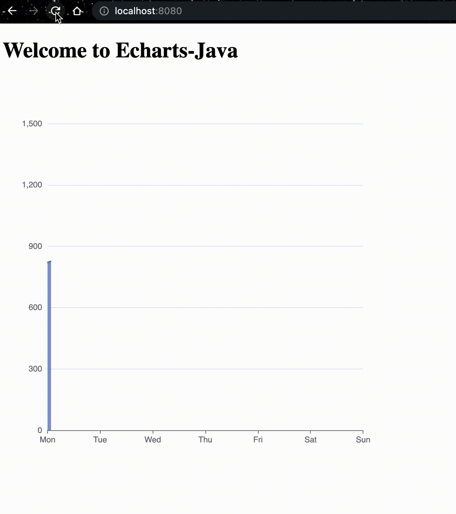

<div align="center">
    
</div>
<h1 align="center">ECharts Java</h1>
<p align="center">
    <em>"We bring better visualization into Java with ECharts"</em>
</p>
<p align="center">
    <a href="https://github.com/ECharts-Java/ECharts-Java/actions">
        
    </a>
    <a href="https://github.com/pyecharts/pyecharts/pulls">
        
    </a>
    <!-- <a href="https://codecov.io/gh/ECharts-Java/ECharts-Java">
        
    </a> -->
    <a href="https://opensource.org/licenses/Apache-2.0">
        
    </a>
    <a href="https://maven-badges.herokuapp.com/maven-central/org.icepear.echarts/echarts-java">
        
    </a>
</p>

[English README](README.md)

[官方文档](https://echarts.icepear.org/#/zh-cn/)

## 📙 简介

ECharts Java 是一款基于 [Apache ECharts](https://echarts.apache.org/en/index.html) 的，简易但全面的数据可视化库。（现支持 Apache ECharts 5.x 版本）。

论简易性，ECharts Java 重新设计了一系列和绘图有关的接口，使得绘图过程更加符合直觉和常理。同时，由于 Apache ECharts 的接口过于复杂和繁琐，我们在 ECharts Java 的图表 API 中简化了部分原本的接口设计。

论全面，ECharts Java 保留了 Apache ECharts “一切皆 Option”的设计理念。因此，除了重新设计的图表 API 以外，我们还保留了自定义 Option 对象的方法。用户可以从零开始，按照 ECharts 的 Option 文档，自定义任何 ECharts 支持的 Option。除此以外，我们还使用链式方法调用等方式，使得 Java 开发者在构建 Option 的过程中更加方便。

## 🌠 特性

- 简单、整洁、高度组织化的 API 接口，支持链式调用
- 完整保存 Apache ECharts 的功能
- 快速集成至当前流行的 Web 框架
- 灵活的导出格式，支持 HTML，PNG 和 JSON
- 完整、详细的文档和示例库

## 🔬 安装

Maven 项目:

```xml
// pom.xml
<dependency>
  <groupId>org.icepear.echarts</groupId>
  <artifactId>echarts-java</artifactId>
  <version>1.0.7</version>
</dependency>
```

Gradle 项目:

```
implementation 'org.icepear.echarts:echarts-java:1.0.7'
```

如果你使用的是其他项目，请参阅[这里](https://search.maven.org/artifact/org.icepear.echarts/echarts-java/1.0.7/jar)。

## 🔭 使用

### 生成 HTML 和下载图片

```java
public static void main(String[] args) {
// All methods in EChart Java supports method chaining
    Bar bar = new Bar()
              .setLegend()
              .setTooltip("item")
              .addXAxis(new String[] { "Matcha Latte", "Milk Tea", "Cheese Cocoa", "Walnut Brownie" })
              .addYAxis()
              .addSeries("2015", new Number[] { 43.3, 83.1, 86.4, 72.4 })
              .addSeries("2016", new Number[] { 85.8, 73.4, 65.2, 53.9 })
              .addSeries("2017", new Number[] { 93.7, 55.1, 82.5, 39.1 });
    Engine engine = new Engine();
    // The render method will generate our EChart into a HTML file saved locally in the current directory.
    // The name of the HTML can also be set by the first parameter of the function.
    engine.render("index.html", bar);
}
```


### 生成 Option 对象和对应的 JSON 结构

```java
public static void main(String[] args) {
    Line lineChart = new Line()
                .addXAxis(new CategoryAxis()
                        .setData(new String[] { "Mon", "Tue", "Wed", "Thu", "Fri", "Sat", "Sun" })
                        .setBoundaryGap(false))
                .addYAxis()
                .addSeries(new LineSeries()
                        .setData(new Number[] { 820, 932, 901, 934, 1290, 1330, 1320 })
                        .setAreaStyle(new LineAreaStyle()));
    Engine engine = new Engine();
    // It is recommended that you can  get the serialized version of Option in the representation of JSON, which can be used directly in the template or in the RESTful APIs.
    String jsonStr = engine.renderJsonOption(lineChart);
}
```

生成的 JSON 对象如下：

```json
{
  "xAxis": [
    {
      "type": "category",
      "data": ["Mon", "Tue", "Wed", "Thu", "Fri", "Sat", "Sun"],
      "boundaryGap": false
    }
  ],
  "yAxis": [{ "type": "value" }],
  "series": [
    {
      "type": "line",
      "data": [820, 932, 901, 934, 1290, 1330, 1320],
      "areaStyle": {}
    }
  ]
}
```

### 集成至 Spring Boot 应用



详细内容请参阅，[文档](https://echarts.icepear.org/#/zh-cn/) ，[代码仓库](https://github.com/incandescentxxc/ECharts-Java-Examples)。

## 🎇 示例

<p float="center">
  
   
  
   
  
  <!--   -->
   
   
   
   
   
   
  
  
  
  
  
  
  
  
  
   
</p>

## 💡 作者

- [@IcePear-Jzx](https://github.com/IcePear-Jzx)
- [@incandescentxxc](https://github.com/incandescentxxc)

欢迎大家积极提 issue，fork，和其他贡献！

## 💌 鸣谢

- 本项目灵感来源于[卡耐基梅隆大学](https://www.cmu.edu/)的课程，[Principles of Software Construction Objects, Design, and Concurrency](https://cmu-17-214.github.io/f2021/)。我们在此真诚地感谢 [Christian](https://www.cs.cmu.edu/~ckaestne/) 和 [Vincent](https://vhellendoorn.github.io/) 在 2021 秋天教授的这门课。

- 本项目同样也受到 [pyecharts](https://github.com/pyecharts/pyecharts) 和 [go-echarts](https://github.com/go-echarts/go-echarts) 的启发。

## 🎈 开源协议

本项目遵循 [Apache License 2.0](LICENSE) 开源协议。
